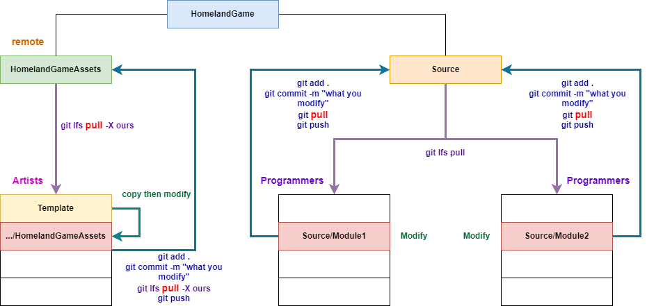

# Homeland Game Collaboration document

## Prerequests

- Windows 10/11, 64-bit
- Intel CPU
- NVIDIA GPU
- A ~~yxorp~~ software that use http://ip:port to allow cmd line access

## Preparations

### IDE Softwares

- [Unreal Engine 5.3](https://www.unrealengine.com/en-US/download)
    - the most bugging editor I've ever seen
    - suggest you use English language interface to match up with tutorials
- Editors:
    - [Visual Studio 2022](https://visualstudio.microsoft.com/zh-hans/free-developer-offers/)
        - with [Resharper C++](https://www.jetbrains.com/resharper-cpp/download/)
    - [Rider 2023.2.3](https://www.jetbrains.com/rider/download/)

Make sure you've down clean downloads to avoid version issues.

After you installed the editors, navigate to UE5 *Edit* $\rightarrow$ *Editor Preference* $\rightarrow$ *General* $\rightarrow$ *Source Code* $\rightarrow$ *Source Code Editor*, select which you want.

### Git

> If you prefer to watch video tutorials, refer to [https://www.youtube.com/watch?v=5n2IMqcrRlk](https://www.youtube.com/watch?v=5n2IMqcrRlk)

#### Git and Git Bash

##### Download and Installation

Download *64-bit Git for Windows Setup* [https://git-scm.com/download/win](https://git-scm.com/download/win)

In `Select Components` tab, make sure you check the `Git LFS (Large File Support)` option, actually you can check everything. If you strongly insist to go without it, make sure you install from [git-lfs official website](https://git-lfs.com/) later.

##### What's the f\*\*k have I installed?

You have downloaded 4 important components:

- Git Bash: A UNIX-like shell that help you run UNIX commands on Windows.
- Git LFS: If you do not want to pay too much to directly store your large assets files on remote git storage platforms, use git large file storage is a good option.
    - For Softwares, only source codes are valid to be open source.
    - For gaming, use git lfs to decrease budgets and avoid occupying too much public resources.
- OpenSSH: A tool that makes you connect to remote git storage platforms (like github) / remote machines with ssh-server.
- Vim: An editing tool in a shell.

And a useless thing:

- Git GUI

Actually with the components downloaded in this step (**No IDEs**), as well as a remote Linux machine, you are able to be a professional system programmer. Besides your brain, **These is all you need**.

##### Configurations

1. Enter `Git Bash` in windows search bar, and open the software.
    - Notice that the only disgusting point of Git Bash is that it does not use `ctrl c/v` to copy paste, but `ctrl/shift Ins`, or just right click and select options. Please remember it.
2. Execute below commands to config your name and email info, replace things in `[]` with your infomation.

```sh
git lfs install
git config --global core.autocrlf false
git config --global user.name [YOUR NAME]
git config --global user.email [YOUR EMAIL]

```

3. Execute `ssh-keygen -t rsa` in `Git Bash`. If it needs you enter output localtion or passphrase, leave it empty as default, just press `Enter`, until execution finishes.
4. Execute `cat ~/.ssh/id_rsa.pub`, select output start from `ssh-rsa` to the end, right click and select *Copy*
5. Create a github account. Go to [https://github.com/](https://github.com/), send your username to [BlueSpace](https://github.com/ETOgaosion) and ask me to invite you into our organization.
6. Click your header in up-right corner, click *Settings* $\rightarrow$ *SSH and GPG keys* $\rightarrow$ `New SSH key`, enter your computer name and paste the public keys to the input boxes, click *Add SSH Key* Buttom.
7. [Optional] The above steps shall have no problems, if you want to test your connections to github, refer to [connecting-to-github-with-ssh/testing-your-ssh-connection](https://docs.github.com/en/authentication/connecting-to-github-with-ssh/testing-your-ssh-connection). But you need to setup network ~~yxorp~~ in most time, you can refer to advanced settings below.

##### [Optional] Advanced Configurations

1. Zsh: You can use zsh and oh-my-zsh as your Git Bash shell to get convinient development experience. Refer to [this tutorial](https://gist.github.com/fworks/af4c896c9de47d827d4caa6fd7154b6b).
    - There are two zsh good plugins, after previous step down, refer to [this guide](https://gist.github.com/dogrocker/1efb8fd9427779c827058f873b94df95).
2. Vim: You can configure vim to be more friendly (but far from being professional). Copy file contents from [git configuration](https://gist.github.com/ETOgaosion/852ce0ad61c7ed9a0a607c14d0e1b922), execute `vim ~/.vimrc` in Git Bash, press `i` key, right click and paste the contents copied before, press `ESC`, `:`, and input `wq`. If you follow this, you will be back to shell environment, then execute `mkdir -p .vim && mkdir -p .vim/.swap && mkdir -p .vim/.backup && mkdir -p .vim/.undo`.
3. ~~yxorp~~: 
    - If you donnot use zsh, use `echo "export http_proxy=http://[ip:port] && export https_proxy=http://[ip:port] && export no_proxy=localhost,[ip]" >> ~/.bashrc` command in Git Bash.
    - If you use zsh, you can use zsh alias to setup your proxy in runtime as your need, but windows zsh has some bugs with this. So just use `echo "export http_proxy=http://[ip:port] && export https_proxy=http://[ip:port] && export no_proxy=localhost,[ip]" >> ~/.zshrc` command in Git Bash.
    - then open a new Git Bash window.

#### Git Desktop

**If I am not accustomed with command-line Git at all, how should I contribute?**

Download [Github Desktop](https://desktop.github.com/) and install, open it after install and login to your github account.

You can easily clone, commit, view changes and push to github with this GUI software.

### Project

> You must be organization member to continue.

#### Create project with UE 5.3

Open UE 5.3 and create an empty project named `HomelandGame` at any location, open the location in Windows File Manager.

#### Clone Repo

##### Git Bash

If your OS is win 10, right click in empty space of this folder and select `Open Git Bash Here`, else if you use win 11, right click and select `More Options` then you will see win 10 right click menu.

Execute `git init . && git branch -M main && git remote add origin git@github.com:HomelandStudio/HomelandGame.git && git pull --recurse-submodules -X theirs`

##### [Not recommand] Github Desktop

Above step is not so convinient to get same result with Github Desktop, the command line has way more options

1. Navigate to *File* $\rightarrow$ *Add local repository*  $\rightarrow$ *choose*, select your `HomelandGame` folder as *Local Path* or input path directly
2. Navigate to *Repository* $\rightarrow$ *Pull*
3. Then navigate to *File* $\rightarrow$ *Clone repository* $\rightarrow$ *URL*, enter `git@github.com:HomelandStudio/HomelandGameAssets.git`, select `HomelandGame/Content` as *Local Path*, finally click clone

#### Import Porject to UE

Open UE project, in `Content Drawer`, navigate to `All/Content/HomelandGameAssets/assets/Map`, double click `HomelandMap`, editor will load the map.

Then navigate to *Edit* $\rightarrow$ *Project Setting* $\rightarrow$ *Project - Maps & Modes* $\rightarrow$ *Default Maps*, change all maps to `HomelandMap`, then whenever you open this project, UE will open our map first.

## Project Structure

We have to understand UE project structure first.

UE project can be split into three parts:

- local templates: never eddited, never push, if you want to use and change them, **copy items to collaborate part first**
- collaborate source codes: small blueprint or C++ codes
- collaborate artworks: large artwork assets

Take our project for example:

```txt
.
|-- Content
|   `-- HomelandGameAssets			// collaborate artworks
|-- Docs							// Documentation wiki, include API, requirements
|-- Homeland.sln					// Visual Studio Project, if you use VS 2022
|-- Homeland.uproject				// UE Project
|-- LICENSE							// Sourse codes can use Mozilla License, assets is close source
|-- README.md
|-- Source							// Source codes
|   |-- Homeland
|   |-- Homeland.Target.cs
|   `-- HomelandEditor.Target.cs
`-- UpgradeLog.htm
```

## Copyright Explanation

Notice that copyrights of all elements in HomelandGameAssets belongs to us, all rights reserved, never allowed to be shared and copied. Thus things like artworks and texts with properties shall be kept in this private repo.

I suggest that we can partially opensource our source codes for others to learn and use. After investigation, Mozilla Public License 2.0 fits into our needs most, reserve neccessary rights for us.

## Collaboration Workflow

Since we understand the project structure, we use this workflow:



For detailed git usage, refer to [https://git-scm.com/docs/gittutorial](https://git-scm.com/docs/gittutorial)

Use `pull` $\rightarrow$ `add` $\rightarrow$ `commit` $\rightarrow$ `pull` $\rightarrow$ `push` process (**Notice that there are too `pull` processes**, to make sure you are working on latest environment at begin and use latest components when you push). But you can find many errors:

1. `pull` failed, because you change some things before last `push` without a `pull`, which causes conflicts.
    - solution: 
        1. let other knows and figure out which file and which loc(line of code) causes conflict,
        2. use merge mode to pull, manually solve conflicts in IDEs. Artworks can use `git pull -X ours` to always use your newest design
2. `push` failed, because others have push things which you didn't `pull`, so make sure you use the second `pull`. You can recheck your designs after this `pull`, make sure everything work formally.

### Blueprint or C++

UE with C++ only works in IDEs like VS or Rider.

Blueprints is hard to coorperate, no readablilty, not support merge, and having no validity to be open source.

Unity C# seems cool at this point.

We can hardly choose one, it seems we should use both for different things. 